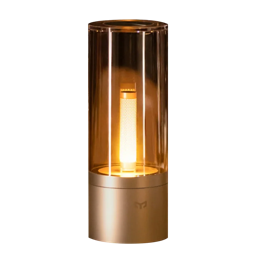

<p align="center">
  
</p>

# Yeelight Candela for Home Assistant

[](https://hacs.xyz/docs/faq/custom_repositories)
[](https://github.com/czaja1994/ha-yeelight-candela/actions/workflows/tests.yml)
[](https://github.com/czaja1994/ha-yeelight-candela/actions/workflows/validate.yml)

A Home Assistant custom integration for **Yeelight Candela** Bluetooth LE lamps
(advertising as `yeelight_ms`). It uses the native Home Assistant Bluetooth
stack, so it works with a built-in adapter, a USB dongle, or an
**ESPHome Bluetooth proxy**. No cloud and no Yeelight app are needed.

## Features

- Automatic discovery through any Home Assistant Bluetooth source, including
  ESPHome proxies that scan passively
- One `light` entity per lamp:
  - on / off
  - brightness
  - **Candle** effect (flicker)
- The lamp's real state is read back through ESPHome proxies (see
  [How it works](#how-it-works)); it is refreshed every 5 minutes, so changes
  made by hand show up
- Commands keep trying for up to 90 seconds, so a lamp that is hard to reach
  still gets switched off; if you change your mind meanwhile, the latest
  command wins
- Optional **Keep connection open** mode for lamps that are slow or unreliable
  to connect to

## Requirements

- Home Assistant **2026.7** or newer with the Bluetooth integration set up
- The lamp must be within **connection range** of a Bluetooth adapter or proxy.
  Seeing the lamp in Home Assistant is not enough: advertisements travel further
  than a stable connection does. A proxy within a few metres of the lamps works
  best.
- If you use an ESPHome Bluetooth proxy, it must allow active connections:

  ```yaml
  bluetooth_proxy:
    active: true
  ```

## Installation

### HACS (recommended)

1. In Home Assistant open **HACS** → ⋮ (top right) → **Custom repositories**.
2. Add `https://github.com/czaja1994/ha-yeelight-candela` with category
   **Integration**.
3. Search for **Yeelight Candela** in HACS, open it and click **Download**.
4. Restart Home Assistant.

### Manual

Copy `custom_components/yeelight_candela` from this repository to
`<config>/custom_components/yeelight_candela` and restart Home Assistant.

## Setup

Lamps within range are discovered automatically: **Settings → Devices &
services → Discovered → Yeelight Candela → Add**. You can also add one
manually with **Add integration → Yeelight Candela**. Each lamp is its own
entry and gets one light entity.

### Switching several lamps at once

Paired Candela lamps mirror each other only when you use them by hand. Over
Bluetooth each lamp is controlled on its own, so create a **Light group**
helper: **Settings → Devices & services → Helpers → Create helper → Group →
Light group**, and add the lamps. The group sends commands to all lamps in
parallel.

### Keep connection open (per lamp)

**Settings → Devices & services → Yeelight Candela → the lamp → ⚙ Configure →
Keep connection open.**

Off by default. When on, the integration connects in the background, never
closes the link when idle, and reconnects automatically (after 5 s, 10 s, 30 s,
then every 60 s) when it drops. Commands then react immediately. Use it for a
lamp that often fails to connect. It permanently uses one of the adapter's or
proxy's connection slots (an ESPHome proxy usually has 3).

## How it works

- **On-demand connection.** Without the keep-connected option the integration
  connects when a command is sent and disconnects after 60 seconds without
  commands, leaving proxy slots free.
- **Commands** are 18-byte frames written to the lamp's Yeelink GATT service
  (`FE87`). The lamp answers each command with a status notification, which
  becomes the entity's state.
- **Retries.** A command keeps reconnecting and retrying for up to 90 seconds.
  A newer command for the same lamp replaces an older one that has not been
  delivered yet (for example *off* followed by *on* only delivers *on*).
- **State through ESPHome proxies.** The lamp's notify characteristic has no
  client configuration descriptor (CCCD), so the standard subscription through
  an ESPHome proxy fails. The integration registers the notification on the
  proxy directly instead. If that is not possible, the entity is marked as
  *assumed state* and only reflects the commands sent.
- **Discovery.** The lamp's main advertisement only carries the name
  `yeelight_ms`, the `FE87` service and the Yeelink company id; the model
  marker `yl_candela` arrives only in the scan response, which passive scanners
  never request. Both cases are recognised.
- **Polling.** The state is read every 5 minutes (the lamp's advertisements do
  not change with its state).

## Known limitations

- **Candle effect.** In flicker mode the lamps tend to drop their Bluetooth
  connection, so starting or stopping the effect can take noticeably longer
  than on/off, and occasionally fails.
- **Lamps that are hard to connect to.** Some lamps accept only a fraction of
  connection attempts (seen with one of two identical lamps, next to each
  other). Commands still get through thanks to the 90-second retries, but can
  take a while; enable **Keep connection open** for such a lamp.
- **Blocking service calls.** A command to an unreachable lamp can take up to
  90 seconds before it fails. Automations wait for it, and voice assistants may
  give up earlier on their side while the command keeps trying.
- **ESPHome proxy on a single-antenna ESP32** shares the radio between Wi-Fi
  and Bluetooth, which makes connections less reliable at the edge of range.

## Troubleshooting

- **Lamp not discovered:** make sure it is powered and near an adapter or proxy
  with active connections enabled. Only lamps advertising as `yeelight_ms` with
  the `FE87` service are offered.
- **Setup keeps retrying / "Could not connect to the lamp":** the lamp is seen
  but a connection can't be established — move a proxy closer or enable
  *Keep connection open* for that lamp.
- **Commands fail through a proxy:** each ESPHome proxy has a limited number of
  connection slots (usually 3). Integrations that keep permanent connections use
  them up.
- **Debug logs:**

  ```yaml
  logger:
    logs:
      custom_components.yeelight_candela: debug
      bleak_retry_connector: debug
  ```

## Supported devices

| Advertised name | Model | Firmware | Status |
|---|---|---|---|
| `yeelight_ms` | Yeelight Candela (model id 7432) | V1.F | tested |

<details>
<summary><strong>Protocol notes</strong></summary>

Measured on firmware V1.F. GATT service `FE87`:

| Characteristic | UUID | Use |
|---|---|---|
| COMMAND | `aa7d3f34-2d4f-41e0-807f-52fbf8cf7443` | write (with response) |
| NOTIFY | `8f65073d-9f57-4aaa-afea-397d19d5bbeb` | notifications (no CCCD) |

Frames are 18 bytes, start with `0x43` and are zero-padded:

| Action | Request | Reply (notification) |
|---|---|---|
| Get state | `43 44` | `43 45 <01 on / 02 off> <brightness> …` |
| On / Off | `43 40 01` / `43 40 02` | `43 45 …` |
| Brightness 1–100 | `43 42 <pct>` | `43 45 01 <pct> …` |
| Candle flicker | `43 67 02` | `43 63 01` (`43 63 03` when it stops) |

A brightness command also stops the flicker and turns an off lamp on. The lamps
additionally expose a Telink mesh service (`00010203-0405-0607-0809-0a0b0c0d1910`),
which is what keeps paired lamps in sync; it is not used.

</details>

## Credits

Protocol details build on earlier reverse engineering in
[candelapy](https://github.com/praschak/candelapy),
[candela_socket_server](https://github.com/jonofe/candela_socket_server) and
[python-yeelightbt](https://github.com/rytilahti/python-yeelightbt).

This project is not affiliated with Yeelight or Xiaomi.

## License

[MIT](LICENSE)
